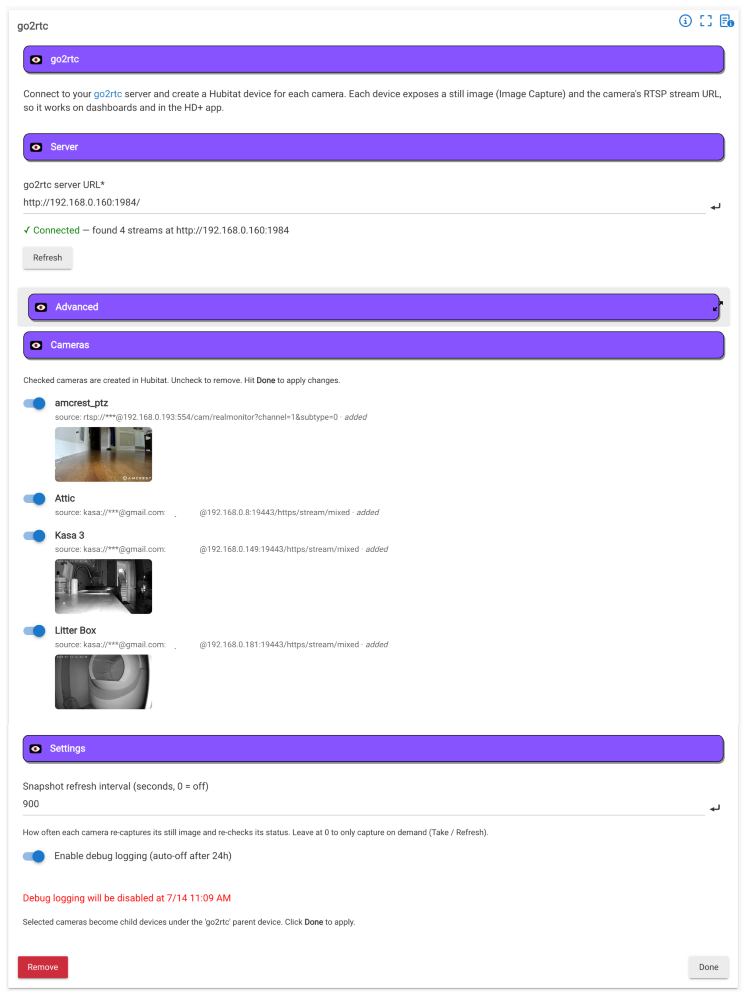

# go2rtc

Hubitat integration for [go2rtc](https://github.com/AlexxIT/go2rtc) — the "ultimate camera streaming application".

Point this app at your go2rtc server and each camera becomes a Hubitat device with a **still image** and **RTSP
URLs for every configured quality** (main, sub, ext, ...), ready for dashboards, rules, and the HD+ app.

----

## Features

- **Auto-discovery** of every stream configured on your go2rtc server (via its REST API)
- **Multi-stream cameras** — main and sub streams grouped into one device (auto-grouped by naming convention, with UI overrides)
- **Pick which cameras to create** — a toggle per camera group, with a live snapshot thumbnail and stream list
- **Still image** on each camera device (Image Capture) — pulled on demand or on a schedule
- **RTSP stream URLs** published per quality (`videoMain`, `videoSub`, ...) plus an active `video` attribute
- **Auto-cleanup** — if you rename or remove a camera on go2rtc, the orphaned Hubitat device is flagged and
  removed when you hit Done

----

## Installation

Install via Hubitat Package Manager (HPM) — search for **go2rtc**. It installs three pieces:

- **go2rtc** (app)
- **go2rtc Parent** (driver)
- **go2rtc Camera** (driver)

## Setup

1. **Apps → Add user app → go2rtc**
2. Enter your **go2rtc server URL** — e.g. `http://192.168.0.160:1984/` — and click **Refresh**.
3. The app lists every camera group on the server. Uncheck any you don't want.
4. Expand **Stream mapping** under a camera to override which go2rtc stream fills each quality role.
5. Click **Done**. A **go2rtc** parent device is created, with one child device per selected camera.

If your go2rtc server requires authentication, expand **Advanced** and enter the username / password (also used
to build the RTSP URL). The RTSP port defaults to `8554` and can be changed there too.



----

## go2rtc YAML naming convention

go2rtc has **no built-in camera/substream grouping** — each stream is an independent name. This integration
groups streams by a naming convention (the same pattern Frigate and others use):

```yaml
streams:
  front_door:       rtsp://192.168.1.10/cam/realmonitor?channel=1&subtype=0   # main
  front_door_sub:   rtsp://192.168.1.10/cam/realmonitor?channel=1&subtype=1   # sub
  front_door_ext:   rtsp://192.168.1.10/cam/realmonitor?channel=1&subtype=2   # optional 3rd quality
```

Recognized role suffixes (case-insensitive, after the last `_`): `main`, `sub`, `ext`, `low`, `high`, `sd`, `hd`.
A bare name with no suffix is treated as **main**. Streams sharing the same base name (`front_door`) become one
Hubitat camera device.

If your stream names don't follow this pattern, use the **Stream mapping** section in the app to assign each
quality role manually.

**Do not** put main and sub URLs under a single go2rtc stream name — that creates alternate producers for the
same stream (failover/transcode), not separate quality levels.

----

## How it works

Discovery uses go2rtc's REST API: `GET {server}/api/streams` returns every configured stream, keyed by name.
The app groups them into camera devices, then creates one Hubitat child per group.

Each camera device exposes:

- **`image`** (Image Capture) — still from the **main** stream: `{server}/api/frame.jpeg?src=NAME` with a
  cache-busting `&refresh=<timestamp>`. Nothing is downloaded to the hub.
- **`video`** — the **active** RTSP URL (defaults to main). Use `selectStream(sub)` to switch.
- **`videoMain`**, **`videoSub`**, **`videoExt`**, **`videoLow`**, **`videoHigh`**, **`videoSd`**, **`videoHd`**
  — fixed RTSP URLs for each configured quality (only present when that role is mapped).
- **`selectedStream`** — which quality role is currently active (`main`, `sub`, ...).
- **`streamRoles`** — JSON map of role → go2rtc stream name.
- **`snapshotUrl`** — still-image URL without the cache-buster.
- **`source`** / **`status`** — producer source (password masked) and online/offline/degraded status.

Commands:

- **`selectStream(role)`** — switch the active `video` attribute to a different quality (e.g. `sub` for low-bandwidth viewing).

The **parent** device is a simple status tile: how many cameras exist and how many are online.

### Using with HD+ and Rules

HD+ video tiles take a direct RTSP URL — point at `videoSub` for a low-bandwidth tile or `videoMain` for full
quality. For dynamic switching, use a Rule to call `selectStream(sub)` before opening a dashboard, or
`selectStream(main)` for full-screen viewing.

### Snapshot refresh

Set a **Snapshot refresh interval** in the app to have every camera bump its image URL (and re-check status) on
a timer. Otherwise the image refreshes on **Take**, device **Refresh**, or when the device is first created.

### Migration from one-stream-per-device

If you previously had separate Hubitat devices for `front_door` and `front_door_sub`, they will merge into a
single `front_door` device on the next **Done**. The old sub-only child device is removed automatically.

### Renamed / removed cameras

When a camera's primary stream no longer exists on the server, its Hubitat device is listed (disabled) at the
bottom of the app under **No longer on the server** and is deleted when you hit **Done**.

----

## Notes

- The app fetches over your LAN each time the config page opens; if the server is unreachable the page shows the
  error and no cameras. Check the URL (include `http://` and the port) and that go2rtc is running.
- Snapshot images can be large — set a **Snapshot width** on a camera device to downscale (go2rtc resizes for you).
- This is open source; issues and PRs welcome.
