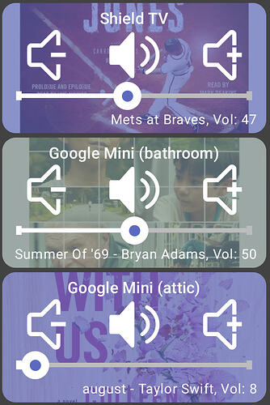

# Google Chromecast+

Hubitat integration for Google Cast / Chromecast devices

See community post: https://community.hubitat.com/t/beta-google-chromecast/164999

## Features

- **Auto-discovery** of Cast devices on your network (manual IP entry as a fallback)
- **Announcements (TTS)** with optional volume, then auto-restore of whatever was playing
- **Play media** by URL (audio or video)
- **Playback control** — play, pause, stop, next / previous, seek, volume, mute
- **Now-playing status** — title, artist, album art, position, current app, and playback state
- **Launch / stop** Cast apps

- Real-time updates over a persistent connection, or quieter on-demand polling

Reliable announcements: fixes the built-in integration's 2‑second TTS cutoff / first‑word clipping.

## Installation

Install via Hubitat Package Manager (HPM) — search for **Google Chromecast+**.

## Setup

- **Apps → Add user app → Google Chromecast+**
- Wait for discovery to find your devices — 15–60s on first open, while the hub fills its mDNS cache in the background.
- Check the devices you want, then click **Done**.

Auto-discovery needs Hubitat firmware **2.4.1.151+**. On older firmware, add devices under **Add a device by IP**.

## How it works

Each selected Chromecast becomes a child device under a single **Google Chromecast+** parent.

The parent shows an at-a-glance summary (how many devices, how many playing); each child exposes the standard Hubitat capabilities — SpeechSynthesis, AudioNotification, MusicPlayer, and AudioVolume — so it works with rules, dashboards, and the HD+ app.

## Why write this when a built-in app already exists?

I spent some time with Home Assistant recently and really liked how it auto detected all of my Chromecast devices (Google Mini speakers, Android TV devices, JBL Speakers with cast support).

I remembered Hubitat has a built-in Chromecast app but it never worked very well for me. After reading lots of support threads I had the feeling this might be a good one to tackle. I wrote it with Claude (AI) and modeled the logic after the Home Assistant code. I've been testing primarily with HD+ - my primary use case is just having it report the currently playing media

I can't guarantee it'll be better than the built-in version but if you have issues that I can test/reproduce I'll try to fix them. And it's open source so worst case anyone can use AI to fix any issues that come up in the future.