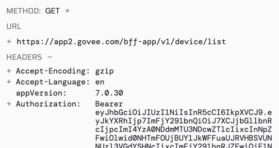

## GoveeLife Smart Thermometer P1 (https://us.govee.com/products/goveelife-smart-pool-thermometer-with-smart-gateway-1s)

This is a custom driver for a Govee Pool Thermometer

To use, you will need a rooted Android device or some other way to capture HTTPS traffic.

Look for the auth token in the traffic, and then add it to the driver

