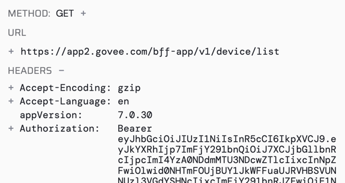

## GoveeLife Smart Thermometer P1 (https://us.govee.com/products/goveelife-smart-pool-thermometer-with-smart-gateway-1s)

This is a custom driver for a Govee Pool Thermometer.

Govee's official developer API doesn't support this device, so the driver uses the same (undocumented) API
the Govee phone app uses. There are two ways to authenticate:

- **Log in automatically** (recommended) — the driver signs in with your Govee account and re-fetches the
  token on its own before it expires. Needs a one-time verification code that Govee emails you.
- **Paste a token by hand** — capture it from the phone app's traffic. No account password involved, but
  you have to re-capture it whenever it expires.

## Option A: automatic login

1. Add a Virtual Device: **Devices → Add Device → Virtual**, pick type **Govee Pool Thermostat**, Save.
2. In preferences, turn on **Fetch the token automatically**, fill in your **Govee account email** and
   **password**, pick a **Refresh Rate**, and hit **Save Preferences**.
3. The first login will fail with *"a verification code has been emailed to you"* — that's expected. Govee
   requires a one-time verification for each new client.
4. Check your email for the code, then run the **Submit Login Code** command with it. The code is valid for
   about 15 minutes; if it expires, run **Request Login Code** for a new one.
5. Done. From then on the driver logs in again on its own — before the token expires, and after any
   rejection — with no further codes needed.

You can leave the *Client ID* preference empty in this mode; the driver generates its own and keeps it
stable (a changing client id would make Govee ask for a new code every time).

Commands: **Login** signs in now, **Request Login Code** emails a fresh code, **Submit Login Code** finishes
a login that asked for one.

## Option B: paste a token by hand

### Capture the credentials

You will need a rooted Android device or some other way to capture HTTPS traffic (HTTP Toolkit works well).
Open the Govee app and look for a request to `https://app2.govee.com/bff-app/v1/device/list`, then copy:

- the **`clientId`** header
- the **`Authorization`** header value (a long `Bearer eyJ...` token)

### Configure

1. Add a Virtual Device: **Devices → Add Device → Virtual**, pick type **Govee Pool Thermostat**, Save.
2. Paste the **Client ID** into preferences, pick a **Refresh Rate**, and hit **Save Preferences**.
3. Paste the **whole token** using the **Set Auth Token** command (the field on the command takes the full
   value — no need to split it, and a leading `Bearer ` is stripped for you). It starts polling immediately.

## Picking the right sensor

If you have more than one Govee temperature sensor on the account, run the **List Devices** command and put
the id you want into the *Govee device id* preference. Otherwise leave it blank.

## Token expiry

Govee tokens are JWTs with a fixed lifetime. With automatic login the driver just fetches a new one before
the old expires — you shouldn't have to do anything. With a hand-pasted token you have to re-capture it, and
the driver tells you when that's due instead of just going quiet:

| attribute | meaning |
|---|---|
| `authStatus` | `ok`, `expiring`, `expired`, `invalid`, `missing`, `error`, `codeRequired`, `loginFailed` |
| `tokenExpires` | decoded from the token itself |
| `tokenDaysLeft` | days remaining (`-1` if the token has no expiry claim) |
| `lastError` | why it's unhealthy (`none` when fine) |
| `tokenSource` | `login`, `command` (Set Auth Token), or `preferences` (legacy fields) |
| `lastUpdated` / `lastUpdatedMs` | when the reading last came in |

Worth a **Rule Machine** rule either way, so a stuck integration can't go unnoticed:

- **Trigger:** `authStatus` *changed* — **Condition:** `authStatus` is `expired`, `codeRequired` or
  `loginFailed` (or trigger on `tokenDaysLeft <= 3` for the hand-pasted case)
- **Action:** notify your phone

To fix a hand-pasted token: capture a fresh one and run **Set Auth Token** again. That takes effect
immediately — no need to touch anything else.

## Commands

| command | what it does |
|---|---|
| `Refresh` | poll now |
| `Login` | log in now and fetch a token |
| `Request Login Code` | ask Govee to email a fresh verification code |
| `Submit Login Code` | finish a login that asked for a verification code |
| `Set Auth Token` | paste the full Authorization token (one field) |
| `Clear Auth Token` | forget the stored token |
| `List Devices` | log every Govee device on the account with its `deviceId` |

## Troubleshooting

- **`authStatus` is `codeRequired`** — Govee wants a verification code. Check your email and run **Submit
  Login Code**. If the code has expired (~15 minutes), run **Request Login Code** first.
- **`authStatus` is `invalid`** — the token was rejected. With automatic login the driver signs in again by
  itself; otherwise re-capture the token. Either way it keeps polling (retrying every 30 minutes) rather
  than giving up, and any of `Set Auth Token` / `Login` / `Refresh` / Save retries at once.
- **`authStatus` is `loginFailed`** — check the email/password. The driver backs off (15 min → 1 h → 4 h →
  12 h); hitting **Save Preferences** resets that and tries again straight away.
- **"app version too low"** in the logs — Govee raised its minimum. Put a newer version string into the
  *Govee app version header* preference — whatever the current Govee app reports. The defaults are `7.0.30`
  for polling and `7.4.10` for login.
- **Nothing happens at all** — enable *Enable debug logging* and hit **Refresh**; every poll logs the URL,
  a masked token and the result. Passwords, verification codes and full tokens are never logged.
